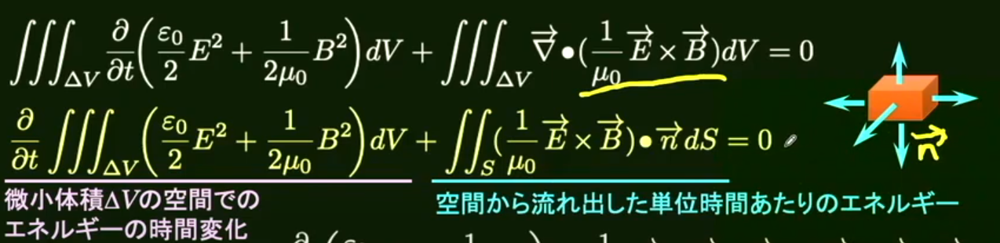
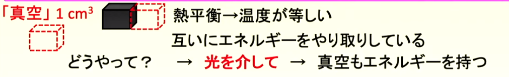

<!-- paginate: true -->

# 量子力学

---

## 電磁場のエネルギー

真空の時の単位体積あたりの電磁場のエネルギーは
$$
u = \frac{ε_0}{2}E^2+\frac{1}{2μ_0}B^2
$$
と表すことができる。また、真空のマクスウェルの方程式より
$$
\frac{\partial}{\partial t}(\frac{ε_0}{2}E^2+\frac{1}{2μ_0}B^2)+\frac{1}{μ_0}(\vec B\cdot(∇×\vec E)-\vec E(∇×\vec B))=0
$$
となり変形すると
$$
\frac{\partial}{\partial t}(\frac{ε_0}{2}E^2+\frac{1}{2μ_0}B^2)+∇\cdot(\frac{1}{μ_0}\vec E×\vec B)=0
$$
となりエネルギー保存則が成り立つ。

---

## ポインティングベクトル

微小体積で積分すると以下の図のようになる。

$\frac{1}{μ_0}\vec E×\vec B$を$\vec S$とおくと、これは単位時間・単位面積あたりｎ流れ出す電磁場のエネルギーをあらわすベクトルとなる。日本語で読むと、エネルギーの変化量はポインティングベクトルで流れ出る。

---

## 座標の設定、系のエネルギー

まずは座標系の準備をする。1粒子の運動自由度はxyz=3なのでN個の粒子(単原子とし回転灯の自由度は考えない)の各座標を表すには
$$
q_i(i=1,2,\dots.f=3N)
$$
とし座標$q_i$に対する運動量は
$$
p_i(i=1,2,\dots,f=3N)
$$
とすればいい。さらにこの系全体のエネルギーは
$$
E=\sum_{i=1}^fα_ip_i^2+V(q_1,q_2,\cdots.q_f)
$$
となる。

---

## ボルツマンの原理

絶対温度Tにおいて、各々の自由度における座標と運動量が
$$
[q_1,q_1+⊿q_1]、[q_2,q_2+⊿q_2]、\cdots、[q_f,q_f+⊿q_f]
$$
$$
[p_1,p_1+⊿p_1]、[p_2,p_2+⊿p_2]、\cdots、[p_f,p_f+⊿p_f]
$$
となる確率分布は$P=P(q_1,q_2,\cdots,q_f,p_1,p_2,\cdots,p_f)$と$⊿q_1⊿q_2\cdots⊿q_f⊿p_1⊿p_2\cdots⊿p_f$の積となる。Pはちゃんと式で表すと以下のようになる。
$$
P=\frac{e^{-\frac{E(q_1,q_2,\cdots,q_f,p_1,p_2,\cdots,p_f)}{K_BT}}}{\int\int\cdots\int e^{-\frac{E(q_1,q_2,\cdots,q_f,p_1,p_2,\cdots,p_f)}{K_BT}dq_1dq_2\cdots dq_fdp_1dp_2\cdots dp_f}}
$$
となるのがボルツマンの原理。

---

## 運動エネルギーの期待値

ここで座標$q_i$の運動エネルギーの期待値$<α_ip_i^2>$は
$$
<α_ip_i^2> = \frac{\int\int\cdots\int e^{-\frac{E(q_1,q_2,\cdots,q_f,p_1,p_2,\cdots,p_f)}{K_BT}}}{\int\int\cdots\int e^{-\frac{E(q_1,q_2,\cdots,q_f,p_1,p_2,\cdots,p_f)}{K_BT}dq_1dq_2\cdots dq_fdp_1dp_2\cdots dp_f}}=\frac{1}{2}K_BT
$$
となる。よって単原子理想期待の場合
$$
E=\frac{3}{2}Nk_BT(つまり\frac{3}{2}Nk_Bが比熱)
$$
個体の場合、各原子は移動しようとすると固定された位置に復元力を受ける=xyz方向をバネに繋がれた状態(振動する)とみなせる。バネのポテンシャルエネルギーは$\frac{1}{2}kx^2$より$βq_i^2$と表せば$E=\sum_{i=1}^{3N}(α_ip_i^2+β_iq_i^2)=3Nk_Bt$

---

## 有限温度の真空のエネルギー

黒体は温度によって光(=電磁波=エネルギー)を放出する。熱平衡状態(外部と温度が等しい)の時、真空中にも光が存在するのでエネルギーが存在する。

---

## 
